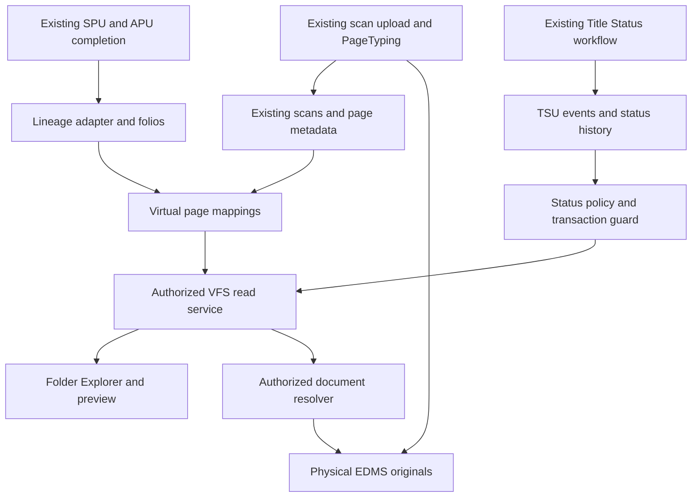
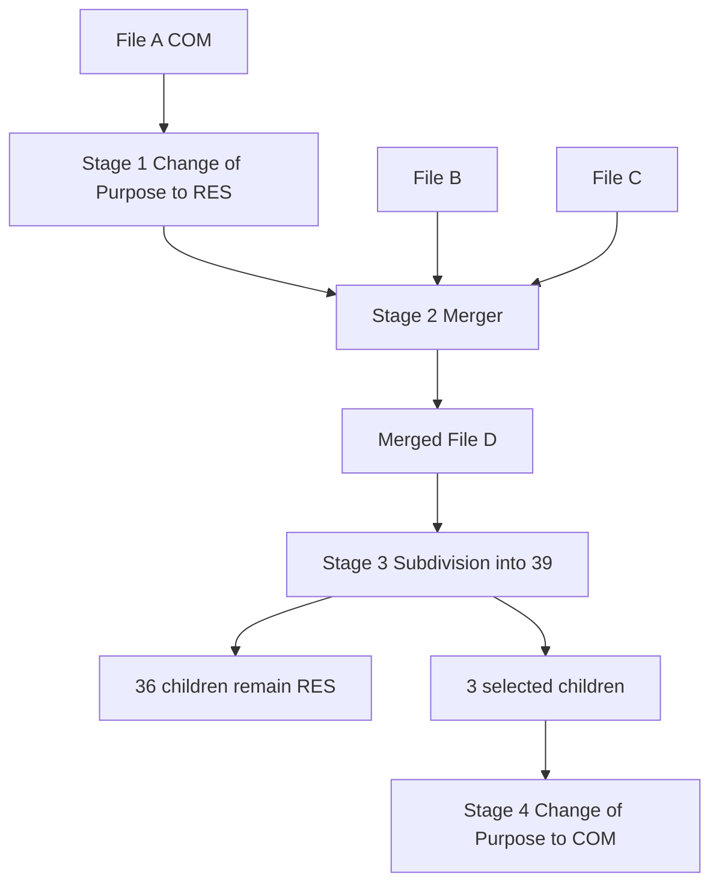
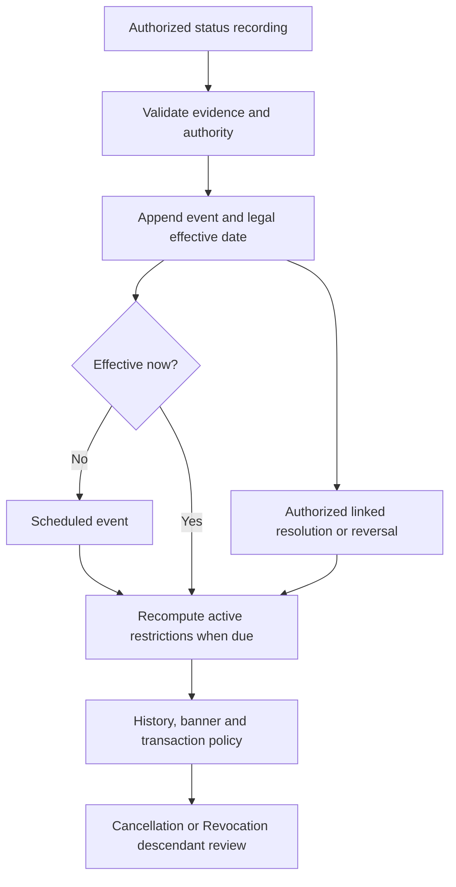
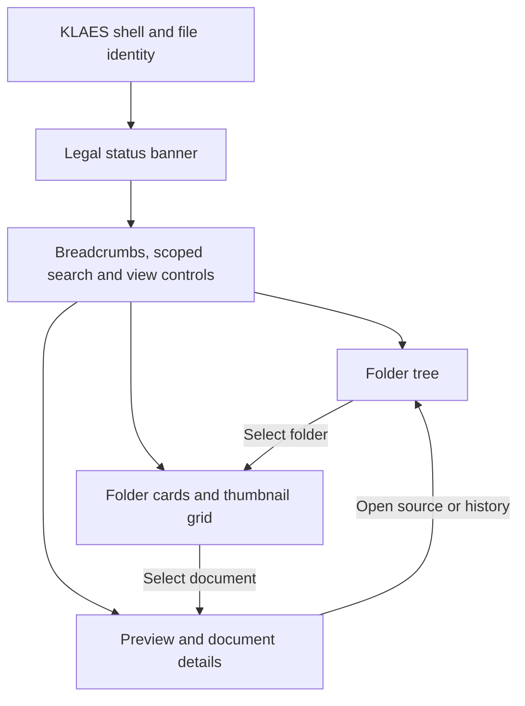
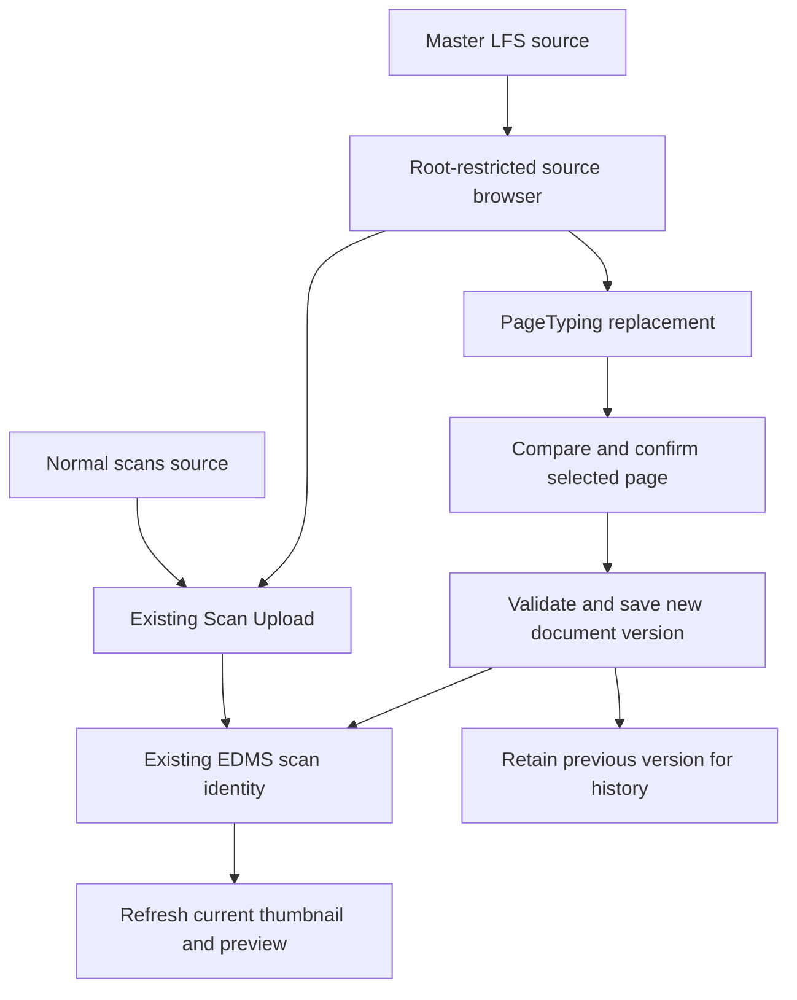

# KLAES VFS and TSU Final Implementation Plan

Revision 2 — 22 September 2026. Includes source corrections, architecture diagrams, folder-style Explorer design, thumbnail and preview requirements, and large-format scan integration.

Source documents: the supplied `Virtual File System (VFS) Framework.pdf` and `Title Status Update (TSU) Extension to the KLAES Virtual File System (VFS) Framework.pdf`. Page references below use PDF page numbers. Repository findings remain from the earlier review at the commit below; this revision does not claim a new repository or live-database audit. New service names, schema adaptations, endpoints and UI layouts are implementation proposals, not verbatim requirements from the PDFs.

## Purpose

This plan extends the existing KLAES EDMS, parcel-update, lineage, decommissioning, and Title Status workflows. It is not a replacement EDMS design. The implementation must preserve existing file numbers, physical EDMS folders, scanning records, page-typing records, and approved SPU and APU behaviour.

Repository reviewed: `ktalib/klaes_edms_1.2`  
Branch reviewed: `main`  
Reviewed commit: `70c9169dcf9c67bde4f80683de88d28a918fd0fe`

## Final Architectural Decision

KLAES will use its current EDMS tables as the physical document layer and add a logical VFS layer above them.

- `file_indexings` remains the indexed file record and current EDMS entry point.
- `scannings` remains the physical-document record and `document_path` remains the physical storage reference.
- `pagetypings` remains the page classification and folio metadata layer.
- Existing SPU tables, duplex APU tables, `decommissioned_files`, and property-lineage data remain authoritative for parcel transformations.
- Existing `title_status_applications` remains the Title Status application and approval register.
- New VFS mappings will reference existing records. They must never copy PDFs or images merely because a folio inherits or displays them.
- New TSU event and status-history records will be created from approved `title_status_applications`; they must not form a second independent capture workflow.
- Existing file-number generation and commissioning logic must not be changed.

## What Already Exists and Must Be Reused

### EDMS physical layer

The repository already contains:

- File indexing and registry detection.
- Scan upload, blind-scan ingestion, scanning reassignment, file-type transfer, and registry transfer.
- Physical storage paths under the EDMS hierarchy.
- Page typing linked through `file_indexing_id` and `scanning_id`.
- EDMS interfaces in `EdmsController`, `ScanUploadsController`, `ScanningController`, and `PageTypingController`.
- Path resolution and folder services under `app/Services/Edms`.

These components must remain responsible for physical files. The VFS must read from them through references.

### SPU and APU

The repository already implements the single parcel-update workflows and multi-stage duplex workflow:

- Subdivision
- Merger
- Extension
- Separation
- Change of Purpose
- Ordered duplex stages and holding numbers
- Final commissioning through existing MLS file-number services
- Decommissioning and parent-child property lineage

The primary implementation points are the parcel-update controllers, `DuplexCommitService`, `PropIdLineageService`, and `decommissioned_files`. The VFS must subscribe to the completed outcomes of these workflows instead of reimplementing them.

### Title Status

The repository already has:

- `title_status_applications`
- `TitleStatusApplication`
- `TitleStatusController`
- `TitleStatusService`
- Title Status capture from File Indexing
- Approval and rejection
- Existing types for Withdrawal, Cancellation, Revocation, Litigation, Amendment, Closure, Surrender, Re-grant, Resettlement, and parcel-update routing
- Source-table flags and `false_decommissioning`
- Read-only Title Status visibility for Deeds and DCIV

This existing workflow must be retained. The new TSU framework begins when an application is approved.

## Important Gaps Found

1. There is no persistent logical folio entity independent of `file_indexings`.
2. There is no general logical-to-physical document/page mapping table.
3. There is no unified chronological status-history table covering SPU, APU, and TSU.
4. The existing Title Status approval only marks the application approved; it does not apply a centralized legal state to the folio.
5. Transaction freezing is not enforced centrally across every SPU/APU/RofO entry point.
6. Litigation-specific structured data and linked reversals are not present.
7. Supporting documents are not linked to TSU events through a dedicated virtual attachment layer.
8. RBAC for high-severity TSU actions is not enforced at the route/controller/policy level.
9. The existing Title Status form accepts broad strings and does not apply type-specific validation rules.
10. Existing `false_decommissioning` rows represent flags, not actual parcel lineage. They must stay excluded from real lineage calculations.
11. The current repository contains no dedicated VFS explorer with current documents, parcel lineage, status timeline, and physical-source views.

## Data Model

Use SQL Server-compatible migrations and the existing integer identity convention. Do not introduce UUID primary keys into this legacy module unless the whole affected chain is migrated consistently. Add public UUIDs only as optional external references if needed.

### 1. `logical_folios`

Create one logical folio per active or historical file identity.

Required columns:

- `id` BIGINT identity primary key
- `public_id` UUID or string unique, optional
- `file_indexing_id` nullable BIGINT, indexed
- `prop_id` nullable string, indexed
- `current_file_no` string, indexed
- `registry` nullable string
- `folio_status` string: `ACTIVE`, `MERGED`, `SUBDIVIDED`, `SUPERSEDED`
- `current_tsu_status` string: `NONE`, `LITIGATION_HOLD`, `CANCELLED`, `WITHDRAWN`, `REVOKED`, `AMENDED`, `CLOSED`
- `tsu_status_since` nullable datetime
- `is_transaction_frozen` boolean default false
- `freeze_reason` nullable string
- `is_temporary` boolean default false
- `created_by`, `updated_by`, timestamps

Constraints:

- Do not make `current_file_no` globally unique until duplicate and historical FileNo data has been profiled.
- Prefer `file_indexing_id` when available and use normalized FileNo plus registry as the fallback identity.
- Never change an existing FileNo during backfill.

### 2. `vfs_document_mappings`

This is the virtual view engine. It references existing physical records.

Required columns:

- `id` BIGINT identity primary key
- `folio_id` BIGINT indexed
- `scanning_id` nullable BIGINT indexed
- `pagetyping_id` nullable BIGINT indexed
- `source_file_indexing_id` nullable BIGINT indexed
- `source_folio_id` nullable BIGINT indexed
- `parcel_event_type` nullable string
- `parcel_event_id` nullable BIGINT
- `origin_context` string
- `display_group` string, for example `CURRENT`, `LINEAGE`, `TSU`
- `sort_order` integer
- `is_active` boolean default true
- `inherited_at` nullable datetime
- `created_by`, timestamps

Rules:

- A mapping points to `scannings` and optionally `pagetypings`; it does not contain another physical path.
- The physical path is resolved from the existing scan record and EDMS path resolver.
- Add a uniqueness rule that prevents the same scan/page being mapped twice to the same folio and context.
- Physical scans must not be moved, renamed, or copied when mappings are created.

### 3. `folio_lineage_events`

Create a normalized event header for completed parcel transformations.

Required columns:

- `id`
- `event_type`: `SPU` or `APU`
- `process_type`: subdivision, merger, extension, separation, change of purpose, temporary commissioning
- `source_table`
- `source_id`
- `batch_reference` nullable
- `sequence_no` nullable
- `effective_at`
- `status`
- `created_by`, timestamps

### 4. `folio_lineage_links`

Required columns:

- `id`
- `lineage_event_id`
- `parent_folio_id`
- `child_folio_id`
- `relationship_type`
- timestamps

Do not delete or immediately replace existing lineage storage. Populate these normalized tables through an adapter service and retain current tables during rollout.

### 5. Extend `title_status_applications`

Add only fields needed for capture and approval compatibility:

- `tsu_subtype`
- `effective_date`
- `expiry_date`
- `trigger_authority_name`
- `reference_number`
- `reversal_of_application_id` nullable
- `approved_event_id` nullable

Preserve current columns and existing records.

### 6. `title_status_events`

Create the immutable legal event log from approved applications.

Required columns:

- `id`
- `folio_id`
- `title_status_application_id`
- `tsu_type`
- `tsu_subtype`
- `trigger_authority`
- `reference_number`
- `effective_date`
- `expiry_date` nullable
- `is_active`
- `is_reversed`
- `reversal_event_id` nullable self-reference
- `justification`
- `created_by`, timestamps

Rules:

- Approval creates one event inside the same database transaction.
- Events are immutable except for controlled reversal linkage and active-state closure.
- Reversing a TSU creates a new event; it never deletes or overwrites the original.

### 7. `folio_status_history`

Required columns:

- `id`
- `folio_id`
- `previous_status`
- `new_status`
- `trigger_event_type`: `SPU`, `APU`, or `TSU`
- `trigger_event_id`
- `changed_by`
- `changed_at`
- `remarks`

Every committed parcel transformation and approved/reversed TSU writes one history row.

### 8. `litigation_cases`

Create structured litigation details linked one-to-one with the relevant TSU event. Store multi-folio case relationships in a relational junction table, not JSON alone.

Required columns include court, case number, parties, filing and judgment dates, judgment summary, injunction type, and case status.

Create `litigation_case_folios` with `case_id` and `folio_id` for multi-parcel litigation.

### 9. `tsu_supporting_documents`

Required columns:

- `id`
- `title_status_event_id`
- `scanning_id`
- `pagetyping_id` nullable
- `document_type`
- `uploaded_by`
- timestamps

The upload must use the existing EDMS scan pipeline. This table only links the physical document to the TSU event.

## Services and Integration Points

### `LogicalFolioResolver`

Responsibilities:

- Resolve a folio from `file_indexing_id`, `prop_id`, FileNo, and registry.
- Create a folio lazily for legacy records when safe.
- Detect ambiguous duplicate FileNos and return a controlled error instead of guessing.

### `VfsMappingService`

Responsibilities:

- Create initial mappings from existing `scannings` and `pagetypings`.
- Inherit mappings during approved/committed SPU and APU operations.
- Add new scan mappings without moving physical documents.
- Return paginated grouped documents for the explorer.

### `FolioLineageAdapter`

Responsibilities:

- Convert existing subdivision, merger, separation, extension, Change of Purpose, duplex, property-lineage, and decommissioning outcomes into normalized VFS lineage events and links.
- Treat `false_decommissioning = 1` as a Title Status flag and never as actual lineage.
- Be idempotent using `source_table` plus `source_id`.

### `TitleStatusStateMachine`

Responsibilities:

- Map approved application types to normalized statuses.
- Validate permitted transitions.
- Apply or release transaction locks.
- Create event and status-history rows atomically.
- Handle reversal through linked events.
- Trigger child-folio legal-review alerts for Revocation and Cancellation.

Initial state effects:

| TSU type | Folio state | Frozen |
| --- | --- | --- |
| Litigation | `LITIGATION_HOLD` | Yes |
| Cancellation | `CANCELLED` | Yes |
| Withdrawal | `WITHDRAWN` | Yes |
| Revocation | `REVOKED` | Yes |
| Amendment | `AMENDED` while otherwise active | No |
| Closure | `CLOSED` | Yes |

Surrender, Re-grant, and Resettlement already exist in KLAES. Preserve their existing behaviour and labels; this update adds the six specified TSU types without redefining unrelated legacy workflows. Do not map a continuation record onto a closure lock merely because its legacy display label belongs to the closure family.

### `FolioTransactionGuard`

All transaction-producing endpoints must call one guard before creating or advancing work.

Minimum coverage:

- Subdivision
- Merger
- Extension
- Separation
- Change of Purpose
- Duplex/APU capture, approval, and commit
- RofO/land recommendation processing
- File commissioning where it creates a successor or child folio
- Other title transactions that change ownership or legal interest

The guard must check the resolved logical folio, not a user-supplied status flag. UI disabling is supplementary; server-side enforcement is mandatory.

## Modification of Existing Title Status Workflow

### Capture

- Keep the current Title Status screens and File Indexing integration.
- Replace unrestricted `title_type` acceptance with an allow-list from the model or config.
- Add type-specific validation for authority, reference number, effective date, reason, and supporting-document requirements.
- Preserve parcel-update routing through `TitleStatusParcelRouter`.

### Approval

Refactor `TitleStatusController::approve()` to call an application service. Inside one SQL transaction:

1. Lock the pending application row.
2. Reject duplicate approval.
3. Resolve the logical folio.
4. Validate authorization for the specific TSU type.
5. Create `title_status_events`.
6. Create litigation details where applicable.
7. Apply the state transition to `logical_folios`.
8. Create `folio_status_history`.
9. Create cascade-review alerts if required.
10. Mark the application approved and store `approved_event_id`.

Integration proposal: retain the existing pending/approved application workflow, while recording the legal effective date separately. A future-dated approved event must remain scheduled until effective; a past-effective event must record both its legal date and the actual recording time. The source litigation workflow applies a hold when an authorized court order is recorded. Implement an authorized record-and-activate path for that case so a pending administrative approval cannot silently delay a court-order hold. Confirm how this path fits the existing approval policy before activating it; do not invent a new Ministry approval requirement.

### Rejection

Rejection must not create a legal-status event or change a folio lock.

### Reversal and resolution

Add a dedicated endpoint and service. Never use update or delete to reverse an approved TSU.

## RBAC

Implement Laravel policies using the existing Spatie permission package. Do not rely on hidden buttons.

Minimum permissions:

- `title-status.view`
- `title-status.capture.litigation`
- `title-status.capture.cancellation`
- `title-status.capture.withdrawal`
- `title-status.capture.revocation`
- `title-status.capture.amendment`
- `title-status.capture.closure`
- `title-status.approve`
- `title-status.reverse`

Use the source RBAC matrix reproduced below. The documented System Admin audit override applies to a TSU reversal, not to bypassing a live transaction freeze. Do not add a general transaction-lock bypass. Map actual deployed roles to permissions rather than hard-coding job titles into controllers.

## VFS API and Interface

Add a read API such as:

- `GET /vfs/folios/{folio}/summary`
- `GET /vfs/folios/{folio}/documents?group=current&page=1`
- `GET /vfs/folios/{folio}/lineage`
- `GET /vfs/folios/{folio}/status-timeline`
- `GET /vfs/folios/{folio}/physical-sources`

The Virtual File Explorer should contain:

1. Current Documents
2. Parcel Lineage
3. Status Timeline
4. Physical Sources

Status banners:

- Litigation: red, read-only, transaction lock
- Cancellation: dark grey, read-only, watermark
- Withdrawal: amber, read-only
- Revocation: bold red, read-only, lock and cascade alert
- Amendment: blue, normal access
- Closure: grey, read-only

Physical-source paths must be exposed only to authorized internal roles. Prefer a controlled view/download route rather than publishing raw server paths.

## Temporary File Handling

Temporary file identity must reuse the existing temporary-file and commissioning logic.

- Mark the relevant logical folio `is_temporary = 1`.
- Map scans from the temporary indexed file.
- When the main file is found, create a lineage event linking temporary and main identities.
- Preserve the temporary physical folder and scan records as historical sources.
- Archive logically; do not delete the temporary scans or change existing FileNos.

## Backfill Strategy

Backfill must be restartable, chunked, logged, and dry-run capable.

### Phase A: Folios

Create logical folios from `file_indexings`, preferring existing `prop_id`. Record duplicate and ambiguous FileNos in an exception report.

### Phase B: Document mappings

Create mappings from `scannings` and `pagetypings`. Do not modify `document_path`.

### Phase C: Lineage

Backfill normalized lineage from existing parcel applications, duplex stages/files, property lineage, and real `decommissioned_files` rows. Exclude `false_decommissioning = 1`.

### Phase D: Title Status

Backfill approved `title_status_applications` into immutable events and history. Do not activate transaction freezing during backfill until records have been reviewed for conflicting simultaneous statuses.

### Phase E: Validation

Produce counts for:

- Indexed files versus resolved folios
- Scans versus mapped scans
- Orphan page typings
- Ambiguous duplicate FileNos
- Approved TSU applications versus events
- Real versus false decommissioning rows
- Lineage records with missing parent or child folios

## Safe Delivery Order

### Release 1: Read-only foundation

- Add VFS and TSU tables.
- Add folio resolver and read models.
- Run dry-run profiling and backfills.
- Add read-only explorer behind a feature flag.
- No transaction blocking.

### Release 2: Live document mappings

- Hook scan creation and page typing into VFS mapping creation.
- Hook completed SPU/APU processes into lineage and inherited mappings.
- Keep dual-read validation against existing EDMS views.

### Release 3: TSU event projection

- Project newly approved Title Status applications into events and history.
- Add status banners and timelines.
- Continue warning-only transaction checks.

### Release 4: Enforcement

- Enable server-side freezing after UAT and data reconciliation.
- Enable reversal workflow. RBAC must already protect every new endpoint from its first release; it is not deferred until enforcement.
- Enable cascade legal-review alerts.

### Release 5: Consolidation

- Remove temporary compatibility reads only after production verification.
- Keep legacy physical tables and history permanently unless a separate approved migration exists.

## Feature Flags

Add configuration flags:

- `VFS_ENABLED`
- `VFS_WRITE_MAPPINGS`
- `TSU_EVENT_PROJECTION_ENABLED`
- `TSU_TRANSACTION_GUARD_MODE=off|warn|enforce`
- `VFS_EXPLORER_ENABLED`

Defaults for first deployment must be read-only/off for writes and enforcement.

## Required Tests

### Unit tests

- Folio resolution by ID, `prop_id`, FileNo, and registry
- Duplicate FileNo ambiguity handling
- Each TSU transition and reversal
- Lock decision for every TSU state
- RBAC decision for every TSU type
- Mapping de-duplication
- `false_decommissioning` exclusion

### Integration tests

- Existing scan upload creates one physical file and one VFS mapping
- Subdivision children inherit mappings without copied storage files
- Merger child displays documents from all source folios
- Ordered duplex stages produce correct lineage sequence
- Litigation approval freezes all covered transaction endpoints
- Litigation resolution releases only the lock introduced by that event
- Revocation produces child review alerts without automatically revoking children
- Amendment remains transactable unless it also invokes an SPU operation
- Rejected Title Status application has no legal effect
- Concurrent approval requests create only one event
- Reversal preserves the original event
- Temporary-to-main-file resolution preserves both physical sources

### Regression tests

- Existing EDMS scanning, page typing, reassignment, file-type transfer, and registry transfer
- Existing SPU forms, approvals, recommendations, and commissioning
- Existing duplex commit and rollback
- Existing file-number generation
- Existing legal-search lineage
- Existing Title Status list, capture, certificate, and read-only registry views
- Existing decommissioning reports and filters

### Non-functional tests

- Paginated virtual folder with at least 5,000 mapped pages
- Indexed query plans for folio and scan lookups
- Permission tests for direct HTTP calls
- Audit-log completeness
- Idempotent backfill and retry
- SQL Server transaction and deadlock behaviour during concurrent approval

## Acceptance Criteria

The implementation is complete only when:

1. No existing FileNo is changed by migration or backfill.
2. No existing EDMS document is copied for inheritance or virtual display.
3. Every VFS document resolves to an existing physical scan record.
4. Existing SPU and APU workflows continue to commission through their current services.
5. Approved TSU applications create immutable events and status history.
6. Frozen folios are blocked at the server across every covered transaction route.
7. Reversal creates a linked event and does not erase history.
8. Revocation and Cancellation identify derived child folios for review without silently changing their legal status.
9. RBAC is enforced by policies and verified by automated tests.
10. The feature can be disabled through flags without breaking the existing EDMS.
11. Backfill reports reconcile all mapped and unmapped records.
12. UAT confirms the Virtual File Explorer shows current documents, lineage, status history, and physical sources correctly.

## Instructions to the Implementation Agent

1. Create a feature branch from the user's current target branch after comparing it with reviewed commit `70c9169dcf9c67bde4f80683de88d28a918fd0fe`. Do not roll the project back to that historical commit or discard newer work.
2. Do not modify file-number formats, generators, or existing FileNos.
3. Do not move, rename, copy, or delete existing EDMS files during VFS work.
4. Do not replace `title_status_applications`; extend it and project approved records into the new event model.
5. Do not treat `false_decommissioning = 1` as parcel lineage.
6. Use SQL Server-safe migrations with `Schema::connection('sqlsrv')` and guarded column/table creation consistent with the repository.
7. Make backfills resumable and provide a dry-run summary before any write mode.
8. Add tests before enabling enforcement.
9. Deliver the work in the release order above, with one focused commit per migration, service, integration hook, UI area, and test group.
10. Stop and request clarification if a duplicate FileNo cannot be resolved by `file_indexing_id`, `prop_id`, registry, or existing lineage. Never guess.

## Source rules and corrections to revision 1

The earlier blanket “Decisions Requiring Ministry Confirmation” section is removed. Several of its questions were already answered by the supplied documents. Implement the following as specified, without requiring a second confirmation.

| Rule | Source | Implementation |
| --- | --- | --- |
| Both Cancellation and Revocation alert derived child folios | TSU section 8, page 12 | Traverse lineage, create review alerts; do not automatically cancel or revoke descendants |
| Amendment remains transactable | TSU workflow 5 and UI table, pages 8–9 | Structural state stays active for in-place amendments; display blue AMENDED badge unless another active restriction applies |
| Closure is read-only with a full transaction lock | TSU workflow 6 and UI table, pages 8–9 | No ordinary transaction exception; reopening is a linked reversal |
| Reversals are allowed to Commissioner and System Admin with audit override | TSU RBAC table, pages 9–10 | Apply those permissions with evidence, actor and reason; do not create a general freeze bypass |
| Historical TSU events remain available | TSU section 8, pages 11–12 | Append event/reversal history; never erase the original event |
| Physical EDMS remains the document source | VFS pages 3–6; TSU architecture, page 11 | Virtual folders are database references; no inheritance-driven image copying |
| Temporary file is archived when main file is recovered | VFS pages 5–6 | Execute the existing approved merge path; preserve temporary-only documents by reference |

### Source RBAC matrix

These are recording permissions from the PDF, separate from any existing application approval permissions.

| Action | Land Officer | Director of Lands | Commissioner | System Admin |
| --- | --- | --- | --- | --- |
| Record Litigation | Yes | Yes | Yes | No |
| Record Cancellation | No | Yes | Yes | No |
| Record Withdrawal | Applicant only | Yes | Yes | No |
| Record Revocation | No | No | Yes | No |
| Record Amendment | Yes | Yes | Yes | No |
| Record Closure | No | Yes | Yes | Yes |
| Reverse TSU | No | No | Yes | Yes, with audit override |

Governor/Commissioner as the legal issuing authority is a different field from the logged-in operator who records the event. Preserve this distinction.

### Limited integration choices

These are engineering decisions or genuine integration questions, not additional Ministry conditions: map existing role IDs to the matrix; determine the authorized immediate court-order recording path; configure the Master LFS path; map legacy status variants without altering their meaning; and establish document-validation requirements using existing operational policy. Continue implementation of all specified behaviour while documenting any unresolved mapping.

## Architecture diagrams

Diagrams use Mermaid so an agent or Markdown viewer can render and maintain them. The data model earlier in this plan is extended by the version and event fields below.

### Existing workflows and new logical layer

The Explorer requests logical content. The resolver reads authorized bytes from the EDMS; no virtual folder creates a disk folder. Existing physical maintenance operations remain separate, permission-controlled workflows.

### APU sequence and parcel branching

Read stages from stored duplex rank; do not sort by process type. A carried file keeps its identity. Newly commissioned identities continue to use existing number-generation logic. Example labels are illustrative.

### TSU activation and reversal

### Explorer layout relationships

## Folder style VFS Explorer design

### Entry points and scope

Add **Open Virtual File** to the existing indexed-file and EDMS action menus, and link to it from Title Status and lineage records. Add a VFS Explorer navigation entry using the existing KLAES shell. A user enters through a registry/file search or directly into a resolved folio. Keep FileNo spelling exactly as stored.

This is a folder-browser experience: folder icons, breadcrumb navigation, visual page thumbnails, a list alternative and a document preview. It must not open as a plain reporting table.

### Desktop composition

| Region | Layout and content | Behaviour |
| --- | --- | --- |
| Application header | Existing KLAES navigation; title “Virtual File Explorer” | Reuse current theme and user menu |
| File header | FileNo, title/holder, registry, property ID and structural status | Link to original indexed record; show legal status separately |
| Status banner | Status, authority reference, effective date, View details | Red litigation/revocation, amber withdrawal, grey closure/cancellation, blue amendment; icons and text supplement colour |
| Explorer toolbar | Back, Up, clickable breadcrumbs, Search this file, grid/list, sort, preview toggle | Preserve folder, search, scroll and selection when navigating back |
| Left navigation | 220–260 px folder navigation, collapsible | Current Documents, Lineage and History, Status Timeline, Source Physical Folders |
| Main browser | Flexible width; folder cards above document grid | Approximately 160–200 px thumbnail tiles, 4–6 columns when space permits |
| Right preview | 300–360 px, collapsible | Selected document image, metadata, source and history |
| Footer | Result count, selected count and pagination | Count documents and PDF pages separately |

At 1024 px use narrower panes or close the preview by default. On tablets the preview opens as a drawer. On phones use a folder navigation drawer, a two-column grid where possible and a full-width preview. No horizontal page overflow; do not shrink text to fit desktop columns.

### Virtual folder hierarchy

| Top-level folder | Child folders or contents |
| --- | --- |
| Current Documents | Groups derived from existing page types: applications, survey plans, approvals, instruments, correspondence and unclassified pages |
| Lineage and History | One folder per SPU event or APU batch; numbered stage folders inside each APU batch; source/result files within each stage |
| Status Timeline | Chronological event entries; each opens an event folder containing its linked evidence |
| Source Physical Folders | One folder card per actual EDMS source, labelled with registry, FileNo and Active/Archived status |

Use existing page-type names where available. The example categories above are proposed presentation groups, not instructions to rename database classifications. Empty groups may be hidden; unclassified scans must remain visible. Do not expose arbitrary “New folder,” Move or Delete operations in this virtual hierarchy.

### Folder cards

Render recognizable yellow folder icons with a clear folder name, item count and optional source FileNo. A lineage folder also shows stage number and process type. One click selects; double-click opens; provide an explicit Open action for touch and keyboard. Folder navigation changes logical filters only. Distinguish virtual group labels from actual physical-source paths.

### Thumbnail cards and list view

Each document tile contains an actual low-resolution preview, document label, file extension, page/folio reference and origin badge. Use “Current,” “Inherited,” “TSU evidence” and “LF” only when supported by metadata. A multi-page PDF gets a page-count badge. A large-format survey should show its landscape aspect ratio with contain-fit, not a cropped square. Long names wrap to two lines and remain fully available in details.

Single click selects and updates the preview; double-click or Enter opens the full viewer. Selection has a visible blue outline and a checkbox for supported bulk actions. Right-click actions must also be available through an accessible ellipsis button. Restrict the initial action menu to Preview, View details, Open source, View history and permitted Download. Avoid implying Explorer drag-and-drop moves physical files.

List mode displays the same result set: name, page type, folio/page, source FileNo, origin, format, modified date. Switching views keeps search, sort, page and selection. Default ordering follows virtual sort order and folio sequence; offer name, page type and date as alternatives.

### Preview panel and full viewer

1. Show document name and source context above the preview.
2. Render JPEG/PNG directly; render PDF pages through the existing viewer or approved viewer component; render TIFF through server-generated previews while keeping originals intact.
3. Provide fit-to-page, fit-to-width, zoom in/out, pan, rotation and page navigation. Rotation in the viewer is temporary and must not save an EDMS edit.
4. Full viewer opens in an accessible dialog with focus management, Escape to close and focus restored to the selected tile. Previous/next follows the filtered result order.
5. Details include classification, source FileNo and registry, scan ID, folio/page reference, source version, dimensions, upload/replace date, and mapped event.
6. Show an “Inherited from …” link and explain which source would be affected before any separate edit workflow is opened.
7. A historical event view must say “Documents at stage N” and use that stage's recorded versions. If history is unavailable, say so explicitly; do not silently substitute today's version.
8. Under cancellation show the required watermark as a viewing overlay. Never burn it into the physical original. Downloads require their own authorization and must make original versus rendered copy clear.

### Explorer interaction states

| State | UI response |
| --- | --- |
| Initial loading | Skeleton folders/tiles with an accessible loading label |
| Empty folder | “No documents in this folder”; permitted route to Scan Upload when appropriate |
| No search matches | Show active filters and Clear search |
| Preview generating | Show format icon and “Preview being prepared”; do not show a broken-image box |
| Missing original | Show “Source document unavailable,” source reference and retry/report action; retain its mapping |
| Permission denied | Return a controlled denial; do not disclose restricted filename, thumbnail or source path |
| Frozen folio | Persistent status banner; block transaction actions; permit authorized reading and resolution evidence workflows |
| Multiple restrictions | Display all active restrictions; a summary badge must never hide a second active hold |
| Historical stage | Explicit stage and date banner, read-only preview, Return to current documents |
| Temporary file | Explain the missing main file and show the temporary source; archived temp source remains discoverable after reconciliation |

### Status event details

Event folder/header includes type, subtype, authority, reference, legal effective date, recording date, actor, previous/new state, reason, documents and reversal link. Litigation shows court, case number, parties, injunction and resolution. Amendment displays before/after values and links any derivative folio or associated SPU. Closure shows reopening history. Cancellation/Revocation shows a descendant review list with each child's unchanged current status, relation and review outcome.

## Supporting backend refinements for the design

### Stable document and page references

Extend the proposed mappings with `document_version_id`, `physical_page_number`, `valid_from`, `valid_to` and an event reference. At least one valid scan/document reference is required. Multi-page PDF page numbers are distinct from registry folio numbers and must not be conflated.

Use a stable physical-document version table (for example `edms_document_versions`) containing scan ID, version number, storage locator, MIME type, checksum, dimensions/page count, recorded-at, actor and reason. Keep the existing scan identity for compatibility. Derivative thumbnails are regenerable caches, not another registry original. Record which version an event view used. Do not promise reconstructed historical images that were overwritten before this feature existed.

Prefer a normalized event identity referenced by lineage, TSU history and mappings, or enforce discriminated type/ID references in one service. A single SQL foreign key cannot reference two different tables. Include TSU-derived folio relationships (withdrawal reapplication and substantial amendment), which cannot be represented by an SPU/APU-only event enum without an explicit link.

Store amendment `before_values` and `after_values` in history or an attached change table. Keep structural lifecycle status separate from legal restrictions. A folio with AMENDED history can still have an active litigation hold.

### Concurrent restrictions and effective dates

Compute locks from all currently effective, unreversed blocking events. Resolving one court case does not remove another hold or restore a superseded parent to structurally active. Lock the folio row during both TSU activation and transaction commit, check all merger/APU input folios and recheck before final writes. Scheduled events must be checked at transaction time as well as by the scheduler so a delayed job cannot permit a prohibited operation.

Legacy capture currently calls `flagAndDecommission`; route the six new TSU behaviours through the explicit state service instead of blindly decommissioning on capture. Preserve existing historical flags and genuine parcel decommissioning. Audit all callers before redirecting side effects; never mass-clear flags from legacy records.

### Physical folder identity

Expose a `PhysicalSource` adapter over existing scan storage locators, registry and indexed records. Multiple actual source folders can serve one folio. If durable source status cannot be represented in existing metadata, add a small physical-source catalogue and link versions to it; do not equate one logical folio with one directory. This covers Active/Archived temporary sources without moving originals.

### API additions

All proposed routes require authentication and object-level authorization, including thumbnails and originals. Adapt names to repository routing conventions.

| Route | Contract |
| --- | --- |
| `GET /vfs/folios/{folio}/folders` | Authorized logical folder IDs, labels, counts and child availability |
| `GET /vfs/folios/{folio}/documents` | Folder/event/as-of version scope, query, filters, sort and pagination; bounded result set |
| `GET /vfs/folios/{folio}/documents/{mapping}/thumbnail` | Version-keyed authorized cached thumbnail or processing state |
| `GET /vfs/folios/{folio}/documents/{mapping}/preview` | Authorized preview of the mapped version and selected PDF page |
| `GET /vfs/folios/{folio}/documents/{mapping}/download` | Separate download permission; reject mapping/folio mismatch |
| `GET /vfs/folios/{folio}/events/{event}` | Event details, sources, results and linked evidence |
| `POST /vfs/view-sessions` | Optional temporary combined APU view; user-scoped opaque ID and expiry |

Document responses include mapping ID, scan/version/page IDs, display name, file type, source identity, classification, origin, event context, preview status and allowed actions. Do not send raw arbitrary filesystem paths as a browser input.

Page results should default to about 60 items with a hard cap. Lazy-load thumbnails, generate expensive LF/PDF previews in bounded background jobs, and never download full-resolution scans to build a grid. Cache keys include document version and rendering parameters. Authorize every cache read; invalidate on replacement or permission change. Measure with at least 5,000 mapped pages.

Temporary combined views cache references only; use TTL cleanup even if a browser crashes, since tab-close events are unreliable. Cache failure falls back to the database. Session ownership, scope and permissions are checked on every read.

## Large-format scan integration from the user's notes

This requirement comes from the user's scan-upload/PageTyping instructions in this conversation, not from either VFS/TSU PDF. Integrate it without turning the virtual folder browser into another physical scanning workflow.

### Two source folders during Scan Upload

Preserve the current indexed-file selector, registry selection, Blind scan/Direct upload controls and File Type category. Add two clearly labelled source controls: **Browse Normal Scans** and **Browse Large-Format Scans**. Show the configured Master LFS source path to authorized operators. It is a scan source, not a new registry/File Type category.

Provide an application folder browser rooted at the configured server or network-share Master LFS path. A web application's local OS file picker cannot be forced to open an arbitrary server path. If staff choose a local upload fallback, label it separately. Validate source selections server-side against the configured root and prevent traversal or arbitrary path access.

### PageTyping and existing scans

Add **Replace with LF Scan** for a selected existing scan and **Add LF Scan** for a missing page. Replacement browses the same Master LFS source, shows old and new previews, selected indexed file, page/folio, dimensions and filename, and asks for explicit confirmation. Preserve scanning identity, file association, order, folio, page type and subtype. Add creates a new scan requiring page typing.

The older image leaves the active view only after the new original has been validated and stored successfully. Proposed recovery protection: retain the old image as a version with an audit record. Do not delete and recreate the scan/page-typing row. Ingest the selected LF original once through the existing storage pipeline; virtual inheritance only references it. Never delete the Master LFS source automatically.

Invalidate and regenerate the thumbnail/preview after replacement. Current VFS mappings follow the approved new version; historical stage mappings remain pinned to the recorded version. If several folios reference the scan, show the impact before confirmation. The Explorer can show an LF badge and route an authorized source owner to the existing replacement workflow; inherited tiles have no direct destructive edit.

Frozen folios remain read-only in the Explorer. Supporting evidence needed to resolve a hold uses a separately authorized TSU evidence action. Do not enable LF replacement on a frozen file through a generic edit bypass.

## UI implementation tasks and verification

Proposed new files: `VfsExplorerController`, VFS read/thumbnail services, `resources/views/vfs/explorer.blade.php`, partials for folder tree, toolbar, document grid, preview and timelines, and one scoped Explorer script/style entry. Names are recommendations; reuse existing components where suitable. Keep UI framework dependencies aligned with the current Laravel/Blade application.

Implement in this order: authorized folder/document read service; folder navigation and breadcrumbs; thumbnails and selection; preview/list/search; historical event browsing; TSU banners and role-controlled actions; LF source selection and version refresh. The LF task can be delivered alongside VFS but must use the same version contract before historical views are advertised.

Additional acceptance tests:

- Open a folio from EDMS and verify its actual FileNo and registry appear without renaming.
- Open a folder from tree, tile, keyboard and touch; breadcrumbs, selected folder and counts agree.
- Select two different documents and verify preview, metadata and source all change consistently.
- Switch grid/list without losing query or selection; empty and no-match states are distinct.
- Open a multi-page PDF, navigate pages and zoom a landscape LF scan without cropping the master.
- Test unsupported preview, missing original and failed thumbnail job with usable fallback states.
- Select a merger stage and see only that event's source mappings and recorded versions.
- Verify a replacement changes current preview while the old historical version stays accessible to authorized viewers.
- Cancel or fail an LF replacement and confirm old active image and all page-typing metadata remain intact.
- Verify all active holds remain visible and one resolution leaves unrelated locks in force.
- Verify Cancellation as well as Revocation produces descendant review alerts exactly once per affected event/folio.
- Reject unauthorized direct calls for metadata, previews, thumbnails, sources, originals and evidence mutations.
- Test 320 px, tablet, 1024 px and desktop layouts; keyboard focus and modal close/return behaviour.
- Confirm a 5,000-page folio initially loads only bounded metadata and visible thumbnails.

Deliver the revised application code with migrations, dry-run reconciliation output, focused tests and screenshots of folder root, selected-document preview, LF replacement, litigation hold and historical stage. Planning mockups use illustrative data and are not screenshots of a deployed implementation.
